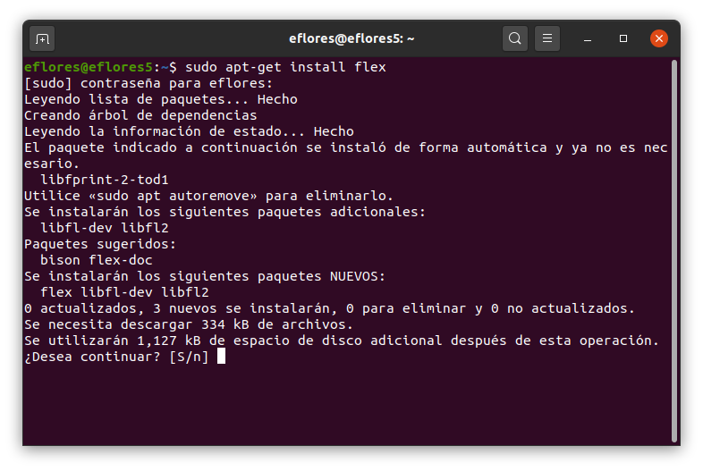
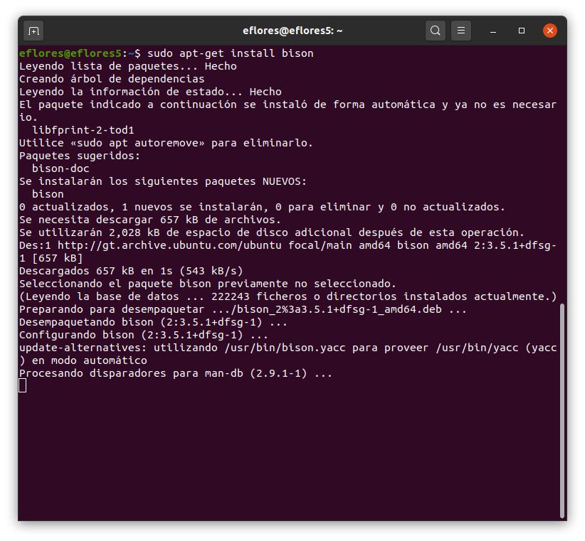
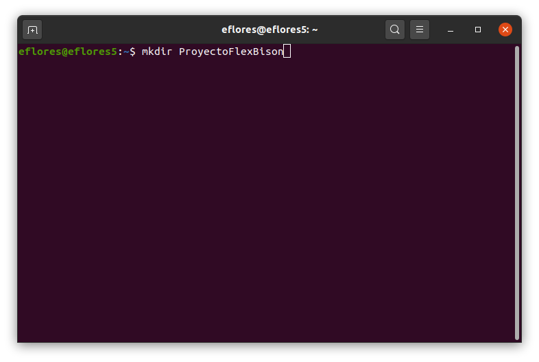
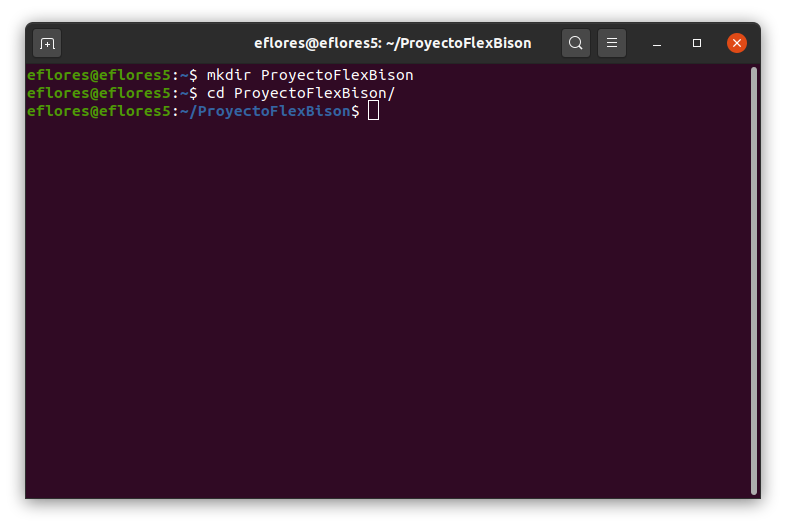
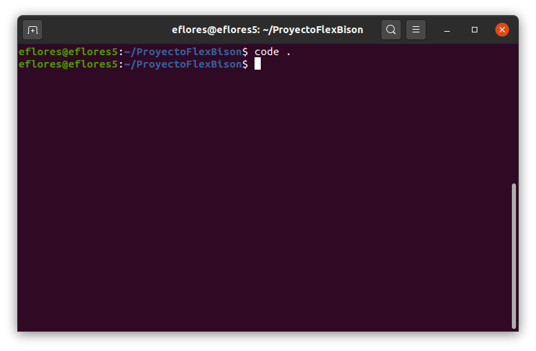
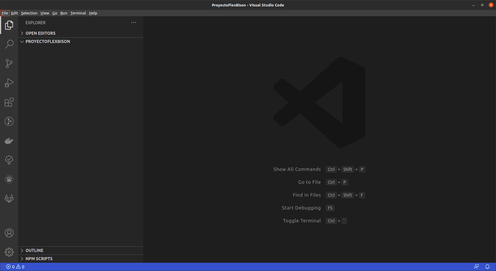
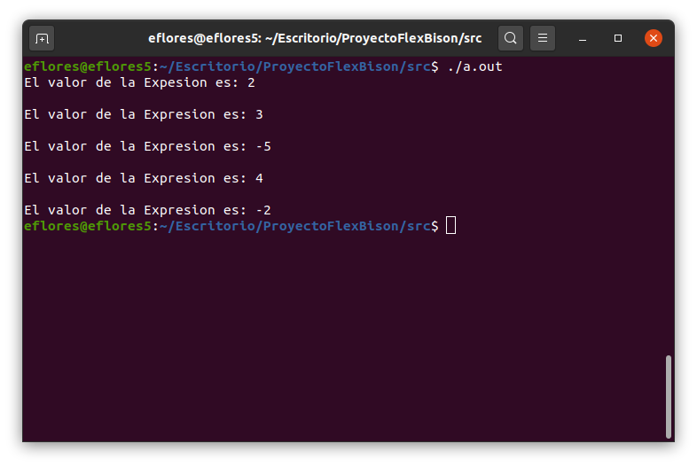

# Mi primer proyecto utilizando Flex y Bison (Linux)
Se desarrollará un intérprete que recibe como entrada varias expresiones aritméticas y presenta como salida el resultado de dichas expresiones.

Las tecnologías a utilizar son:
* Flex: Generador de analizadores léxicos
* Bison: Generador de analizadores sintácticos
* Ubuntu 20.04: Sistema operativo
* Visual Studio Code: Editor de código fuente
* C++: Lenguaje de programación

El proyecto completo del ejemplo puede descargarse en el siguient enlace:
https://github.com/ericknavarro/ProyectoFlexBison

## Flex
Flex es una herramienta que permite generar analizadores léxicos a partir de un conjunto de reglas y expresiones regulares. Desarrolado por GNU bajo la licencia GPL. Escrito en C para C y C++.

La principal tarea de un analizador léxico es leer los caracteres de entrada del programa fuente, agruparlos en lexemas y producir como salida una secuencia de tokens.

* Un token es un par que consiste en un nombre de token y un valor de atributo opcional.
* Un lexema es una secuencia de caracteres en el programa fuente, que coinciden con el patrón para un token y que el analizador léxico identifica como una instancia de este tóken.
* Un patrón es una descripción de la forma que pueden tomar los lexemas de un token.

El código fuente de Flex se encuentra en el siguiente enlace: 
https://github.com/westes/flex/

## Bison
Bison es un generador de analizadores sintácticos ascendentes escrito en C para C y C++.

El analizador sintáctico obtiene una cadena de tokens del analizador léxico y verifica que dicha cadena pueda generase con la gramática para el lenguaje fuente. Una gramática proporciona una especificación precisa y fácil de entender de un lenguaje de programación.

La página oficial de Bison se encuentra en el siguient enlace: https://www.gnu.org/software/bison/ 

## Prerequisitos
Para este ejemplo neceistamos las siguientes herramientas:
* Compilador GCC
* Visual Studio Code (o cualquier editor de texto de nuestro agrado)

## Instalación y configuración de las herramientas
Lo primero que haremos será instalar Flex, para ello abrimos una terminal, en Ubuntu puede hacerse con la combinación de teclas **Ctrl + Alt + t** o en **Aplicaciones → Accesorios → Terminal**, una vez abierta la terminal ingresamos el comando ``sudo apt-get install flex``, autenticamos ingresando nuestra contrase;a y aceptamos la descarga e instalación, con esto quedará instalado **Flex**.



Luego instalamos bison, ejecutando el comando ``sudo apt-get install bison``, autenticamos ingresando nuestra contraseña y aceptamos la descarga e instalación, con esto quedará instalado **Bison**.


## Crear nuestro proyecto
Creamos un nuevo folder el cual será nuestro espacio de trabajo, para crearlo abrimos una terminal y ejecutamos el comando ``mkdir ProyectoFlexBison``. Luego ingresamos a nuestro folder con el comando ``cd ProyectoFlexBison``.



Ahora nos pasamos a el editor de código, en este caso usaremos Visual Studio Code. Para abrir nuestro directorio de trabajo en Visual Studio Code ejecutamos desde la terminal el comando ``code . `` el punto al final es importante, ya que le indica a Visual Studio Code que abra una nueva ventana en el directorio actual.


Esto desplegará una ventana de Visual Studio Code, con nuestro proyecto llamado **ProyectoFlexBison**.


Definimos la estructura de nuestro espacio de trabajo creando un directorio llamado ``src`` en donde estará todo nuestro código fuente. Sobre el diectorio ``src`` creamos un directorio ``analizador``, en este directorio estará todo el código relacionado con bison y flex.

### Código fuente para el controlador
Previo a la creación de los archivos de flex y bison vamos a crear un controlador que será el encargado del intercambio de datos entre el analizador léxico y el analizador sintáctico.

Creamos el archivo de cabecera ``driver.h`` sobre el directorio ``analizador``.
```c++
#include <string>
#include "parser.tab.hh"

#define YY_DECL \
  yy::Parser::symbol_type yylex (Driver& driver)
YY_DECL;

class Driver {
  public:
    void runScanner();
    void closeFile();
    void parse(const std::string& archivo);
    std::string file;
};
```

Luego creamos el archivo ``driver.cc`` en la misma ruta en el que fue creado el archivo de cabecera.
```c++
#include "driver.h"
#include "parser.tab.hh"

void Driver::parse(const std::string& archivo){
  file = archivo;

  runScanner();
  yy::Parser parser(*this);
  parser.set_debug_level(false);
  parser.parse();
  closeFile();
}
```

### Explicación código fuente para el controlador
En la sección de includes y define del archivo de cabecera ``driver.h``:

* Primero incluimos la biblioteca **String** que nos servirá para el manejo de cadenas.
* Incluimos el archivo de cabecera ``parser.tab.hh``, este se mostrará mas adelante, como resumen es el archivo que genera bison a partir de nuestra gramática.
* Luego viene la declaración de la función de escaneo.

```c++
#include <string>
#include "parser.tab.hh"

#define YY_DECL \
  yy::Parser::symbol_type yylex (Driver& driver)
YY_DECL;
```
Luego definimos las funciones y atributos de nuestra clase ``Driver``:
* La función ``runScanner`` será la encargada de inciar el análisis.
* La función ``closeFile`` será la encargada de finalizar el análisis.
* La función ``parse`` recibe como parámetro la dirección del archivo de entrada y será la encargada del análisis sintáctico.
* El atributo ``file`` de tipo string se utilizará para almacenar la ruta del archivo de

```c++
class Driver {
  public:
    void runScanner();
    void closeFile();
    void parse(const std::string& archivo);
    std::string file;
};
```

Para el archivo ``driver.cc``, en la sección de includes:
* Incluimos el archivo de cabecera del driver ``driver.h``
* Incluimos el archivo de cabecera ``parser.tab.hh``, este se mostrará mas adelante, como resumen es el archivo que genera bison a partir de nuestra gramática.
```c++
#include "driver.h"
#include "parser.tab.hh"
```

Luego definimos las rutinas a ejecutar en la función ``parse`` que definimos en el archivo de cabecera ``driver.h``. Esta realiza las siguientes tareas:

* Guarda la ruta del archivo en el atributo file.
* Llama a la función ``runScanner()`` que inicia el análisis.
* Crea un objeto ``Parser``, este se explica mas adelante.
* La llamada al método ``set_debug_level(false)`` indica que no se imprima en consola el proceso que realiza el analizador.
* Luego se llama al metodo ``parse`` el cual realiza el análisis sintáctico.
* Por último con ``closeFile()`` se finaliza el proceso de análisis.

```c++
void Driver::parse(const std::string& archivo){
  file = archivo;
  runScanner();
  yy::Parser parser(*this);
  parser.set_debug_level(false);
  parser.parse();
  closeFile();
}
```

### Código fuente para el analizador léxico
En el archivo ``lexico.l`` incluiremos todo el código que le indicará a Flex lo que debe de hacer. El código se muestra a continuación:
```c++
%{
  #include <stdio.h>
  #include <string>
  #include "driver.h"
  #include "parser.tab.hh"
%}

%option noyywrap
%option outfile="scanner.cc" 

DIGIT   [0-9]
NUM     {DIGIT}+("."{DIGIT}+)?

%%

{NUM}           {return yy::Parser::make_NUM(strtol (yytext, NULL, 10));}
"evaluar"       {return yy::Parser::make_EVALUAR();}
"+"		          {return yy::Parser::make_MAS();}
"-"		          {return yy::Parser::make_MENOS();}
"*"		          {return yy::Parser::make_POR();}
"/"		          {return yy::Parser::make_DIV();}
"("		          {return yy::Parser::make_PARIZQ();}
")"		          {return yy::Parser::make_PARDER();}
";"		          {return yy::Parser::make_PTOCOMA();}

[[:blank:]]     {}
.               {printf("Caracter no reconocido: %s\n",yytext);}
<<EOF>>		      {return yy::Parser::make_FIN();}
%%

void Driver::runScanner(){
    yy_flex_debug = false;
    yyin = fopen (file.c_str (), "r");
    if(yyin == NULL){
        printf("No se encontro el archivo de entrada");
        exit(1);
    }
}

void Driver::closeFile(){
    fclose(yyin);
}
```

### Explicación código fuente para el analizador léxico
En las primeras lineas incluimos el ficherio ``stdio.h`` para la lectura de archivos, la biblioteca ``string`` para el manejo de cadenas, incluimos nuestro controlador creado anteriormente y la cabecera ``parser.tab.hh`` que es el archivo que genera bison para nuestro analizador sintáctico. 
```c++
%{
  #include <stdio.h>
  #include <string>
  #include "driver.h"
  #include "parser.tab.hh"
%}
```

Establecemos una lista de directivas propias de Flex:
* La directiva **noyywrap** le indica a Flex que unicamente leera un archivo de entrada.
* En la directiva **outfile** establecemos el nombre del archivo que generará Flex.
```c++
%option noyywrap
%option outfile="scanner.cc" 
```

Luego se escriben algunas expresiones regulares para identificar enteros y decimales.
```c++
DIGIT   [0-9]
NUM     {DIGIT}+("."{DIGIT}+)?
```

En esta sección definimos todas las reglas léxcias, en las que indicamos patrones que reconocerá y dentro de llaves lo que debe hacer cuando los reconozca. Para retornar nuestras reglas como tokens y que puedan ser utilizadas en el analizador sintáctico le definimos el prefijo **make_** seguido del nombre que le asignemos al token. En el caso de **NUM** adicional al token debemos regresar el valor numérico reconocido, por lo que es necesario hacer una conversión con la función **strtol** que convierte una cadena a un número. Para los espacios en blanco, flex cuenta con una directiva **[[:blank]]** donde podemos ver que no retornamos ningún simbolo, ya que ignoramos los espacios en blanco. Luego indicamos con un punto que todo lo que no fue reconocido en las reglas anteriores será un error léxico. Por último es necesario indicar con **<<EOF>>** el final del análisis del archivo de entrada.

```c++
%%
{NUM}           {return yy::Parser::make_NUM(strtol (yytext, NULL, 10));}
"evaluar"       {return yy::Parser::make_EVALUAR();}
"+"		          {return yy::Parser::make_MAS();}
"-"		          {return yy::Parser::make_MENOS();}
"*"		          {return yy::Parser::make_POR();}
"/"		          {return yy::Parser::make_DIV();}
"("		          {return yy::Parser::make_PARIZQ();}
")"		          {return yy::Parser::make_PARDER();}
";"		          {return yy::Parser::make_PTOCOMA();}

[[:blank:]]     {}
.               {printf("Caracter no reconocido: %s\n",yytext);}
<<EOF>>		      {return yy::Parser::make_FIN();}
%%
```

Por último, en esta sección definimos las funciones que establecimos en nuestro Driver.
* La función **runScanner()** busca el archivo de entrada y lo almacena en la variable **yyin**, si el archivo no existe finaliza el programa, adicionalmente establece el atributo **yy_flex_debug** como falso, esto para que no se vea en consola el proceso del analizador léxico.
* La función **closeFile()** cierra el archivo que abrimos en la función **runScanner()** luego de que finalice el análisis.

```c++
void Driver::runScanner(){
    yy_flex_debug = false;
    yyin = fopen (file.c_str (), "r");
    if(yyin == NULL){
        printf("No se encontro el archivo de entrada");
        exit(1);
    }
}

void Driver::closeFile(){
  fclose(yyin);
}
```


### Código fuente para el analizador sintáctico
En el archivo ``parser.yy`` incluiremos todo el código que le indicará a Bison lo que debe de hacer. El código se muestra a continuación:
```c++
%skeleton "lalr1.cc" /* -*- C++ -*- */

%defines
%define api.parser.class {Parser}
%define api.token.constructor
%define api.value.type variant

%define parse.trace
%define parse.error verbose
%param { Driver& driver }


%code requires
{
   class Driver;
}

%{
   
   #include <string>
   #include <stdio.h>
   #include "driver.h"
   #include <iostream>
%}


/******* TERMINALES ********/
%token MAS"+" MENOS"-" POR"*" DIV"/" PARIZQ"(" PARDER")" PTOCOMA";" EVALUAR"EVALUAR"
%token <float> NUM "NUM"
%token FIN 0 "eof"

%left MAS MENOS
%left POR DIV
%precedence NEG 

/******* NO TERMINALES ********/
%type <float> Expr
%start Inicio;

%%

   Inicio 
      : Lista ;


   Lista
      : Lista "EVALUAR" "(" Expr ")" ";"
      {
         std::cout<< "El valor de la Expresion es: " << $4 << "\n";
      }
      | "EVALUAR" "(" Expr ")" ";"{
         std::cout<< "El valor de la Expesion es: " << $3 << "\n";
      }
   ;

   Expr 
      : Expr "+" Expr {
         $$ = $1 + $3;
      }
      | Expr "-" Expr {
         $$ = $1 - $3;
      }
      | Expr "*" Expr{
         $$ = $1 * $3;
      }
      | Expr "/" Expr{
         $$ = $1 / $3;
      }
      | "-" Expr %prec NEG{
         $$ = -$2;
      }
      | "NUM"
      {
         $$ = $1;
      }
      | "(" Expr ")"
      {
         $$ = $2;
      }
   ;
      
%%

void yy::Parser::error( const std::string& error){
  std::cout << error << std::endl;
}
```

### Explicación código fuente para el analizador sintáctico
En las primeras lineas le indicamos a Bison una seria de directivas. En la primera le indicamos el tipo de analizador que queremos que ejecute en nuestra gramática, en este caso un analizador **LALR(1)**. Las siguientes directivas le indican a Bison el nombre de la clase que se va a generar, que genere un constructor. Luego las directivas **parse.trace** y **parce.error verbose** se utilizan para el manejo de errores sintácticos. Por último se le indica a Bison que la clase que genere va a recibir un parametro de tipo Driver.

En el siguiente link se encuentra mas detallado el uso de cada directiva: 
https://www.gnu.org/software/bison/manual/html_node/_0025define-Summary.html

```c++
%skeleton "lalr1.cc" /* -*- C++ -*- */

%defines
%define api.parser.class {Parser}
%define api.token.constructor
%define api.value.type variant

%define parse.trace
%define parse.error verbose
%param { Driver& driver }
```

En la siguiente sección se agregan las bibliotecas, librerías y cabeceras necesarias para la ejecución del analizador sintáctico. La instrucción ``class Driver`` en **code requires** es importante para agregar las funciones que establecimos en esa clase. Luego incluimos bibliotecas como string, stdio, la cabecera de nuestro Driver y por último iostream.

```c++
%code requires
{
   class Driver;
}

%{
   
   #include <string>
   #include <stdio.h>
   #include "driver.h"
   #include <iostream>
%}
```

Luego se definen los no terminales, a estos se les puede indicar o no un tipo. Para los terminales que son simbolos o palabras reservadas no es necesario indicarles el tipo y se les puede indicar por medio de comillas el simbolo asociado, esto para no estar escribiendo todo el nombre del terminal y que la gramática se vea mas limpia. Esta lista de terminales debe coincidir con los simbolos que establecimos en el archivo **lexico.l**. Como podemos ver, al terminal **NUM** si se le indica un tipo de dato, ya que nos servirá para realizar las operaciones aritméticas.

```c++
/******* TERMINALES ********/
%token MAS"+" MENOS"-" POR"*" DIV"/" PARIZQ"(" PARDER")" PTOCOMA";" EVALUAR"EVALUAR"
%token <float> NUM "NUM"
%token FIN 0 "eof"
```

Posteriormente podemos indicar la precedencia de operadores, ya que la gramática escrita es ambigua, es necesario definir una precedencia para que el analizador no entre en conflicto. El nivel de precendencia se define del mas bajo al mas alto. La precendencia mas baja la tienen la suma y la resta, seguido por la multiplicación y división y por último tenemos el signo menos de las expresiones negativas.

```c++
%left MAS MENOS
%left POR DIV
%precedence NEG 
```

A continuación tenemos el conjunto de reglas de escritura de la gramática o producciones. Primero definimos el tipo de nuestros No terminales si en dado caso lo requerimos, para este caso unicamente se requiere asignarle un tipo de dato al no terminal Expr. Luego le indicamos a Bison cual será nuestro símbolo inicial. Finalmente escribimos nuestras producciones, para asignar reglas de producción lo hacemos mediante llaves "{ }", en esta sección podemos escribir código de C++. Ya que los analizadores que utiliza Bison son ascenentes, nos permiten sintetizar atributos, para sintentizar un atributo lo hacemos a traves del identificador "$$".


```c++
%type <float> Expr
%start Inicio;

%%
   Inicio 
      : Lista ;


   Lista
      : Lista "EVALUAR" "(" Expr ")" ";"
      {
         std::cout<< "El valor de la Expresion es: " << $4 << "\n";
      }
      | "EVALUAR" "(" Expr ")" ";"{
         std::cout<< "El valor de la Expesion es: " << $3 << "\n";
      }
   ;

   Expr 
      : Expr "+" Expr {
         $$ = $1 + $3;
      }
      | Expr "-" Expr {
         $$ = $1 - $3;
      }
      | Expr "*" Expr{
         $$ = $1 * $3;
      }
      | Expr "/" Expr{
         $$ = $1 / $3;
      }
      | "-" Expr %prec NEG{
         $$ = -$2;
      }
      | "NUM"
      {
         $$ = $1;
      }
      | "(" Expr ")"
      {
         $$ = $2;
      }
   ;
      
%%
```

Como último paso, definimos la función que será llamada si existiera un error sintáctico. Esta función es propia de Bison.
```c++
void yy::Parser::error( const std::string& error){
  std::cout << error << std::endl;
}
```

### El archvio de compilación
En el archivo **compilar.sh**, ejecutamos dos lineas, la primera indica a Flex que debe generar un analizador léxico en base al código fuente que se encuentra en el archivo Léxico. La segunda linea le indica a Bison que genere los archivos de compilación para el analizador sintáctico en base al archvio Parser.

```sh
flex lexico.l
bison parser.yy
```

Para ejecutar abrimos una terminal sobre el directorio ``analizador`` y ejecutamos lo siguiente:
```sh
./compilar.sh
```

**Nota:** Si el comando genera error, asegurese de que el archivo tenga permisos de ejecución.

Este comando genera una serie de archivos que se han mencionado ya anteriormente. Los archivos que genera son los siguientes:
* parser.tab.cc
* parser.tab.hh
* scanner.cc
* stack.hh

### Archivo de entrada
Dentro de la carpeta src del proyecto, creamos un archivo de entrada llamado **entrada.txt**, que contendrá el archivo de enetrada que reconocerán nuestros analizadores.

El archivo contiene lo siguiente:

```txt
evaluar(1+1);
evaluar(1+1*2);
evaluar(-(1+1*6/3-5+7));
evaluar(-(1+1*6/3-5+1*-2));
evaluar(-(1+1));
```

### Archivo Principal
Dentro del archivo principal definimos el método *main*, en este creamos un objeto Driver y ejecutamos su método parse, como parámetro le pasamos el nombre del archivo que vamos a analizar.

```c++
#include <stdio.h>
#include "./analizador/driver.h"

int main() {
	Driver driver;
	driver.parse("entrada.txt");
	return 0;
}
```

### Ejecutando nuestra aplicación
Para ejecutar nuestra aplicación necesitamos compilar todos los archivos y generar el ejecutable. Esto lo realizamos con el compilador de c++ ejecutando desde consola el siguiente comando:

```sh
c++ main.cc ./analizador/*.cc
```
Este nos genera un archivo ``a.out``, este archivo lo ejecutamos desde consola y obtenemos la salida de nuestro proyecto.



## Fuentes Consultadas
Compiladores, principios, técnicas y herramientas. Aho, Lam, Sethi y Ullman. Segunda Edición.